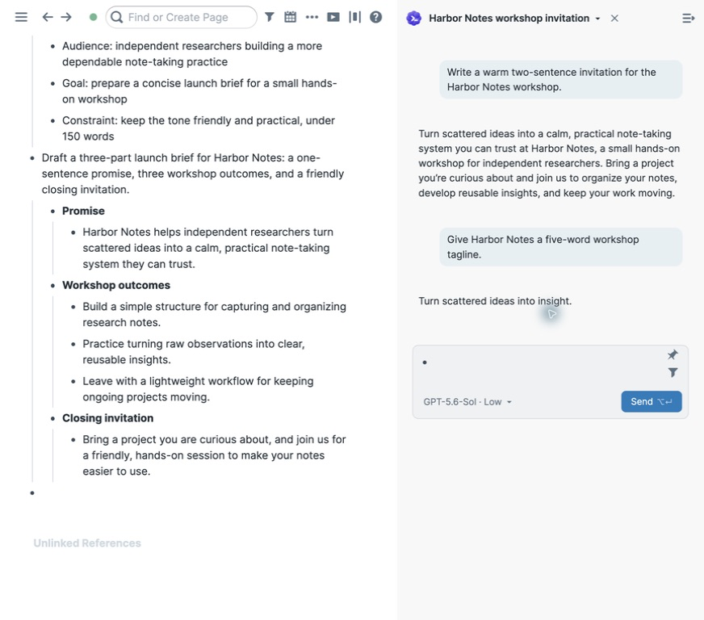
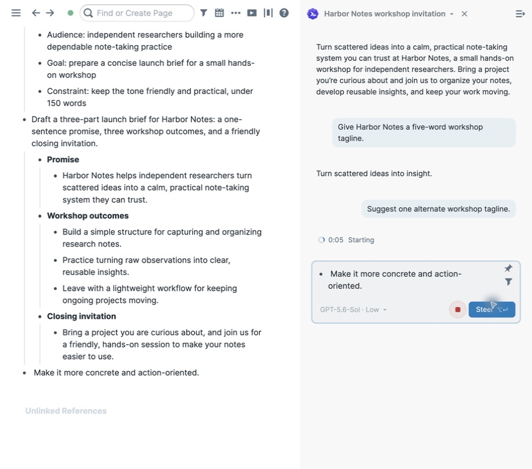
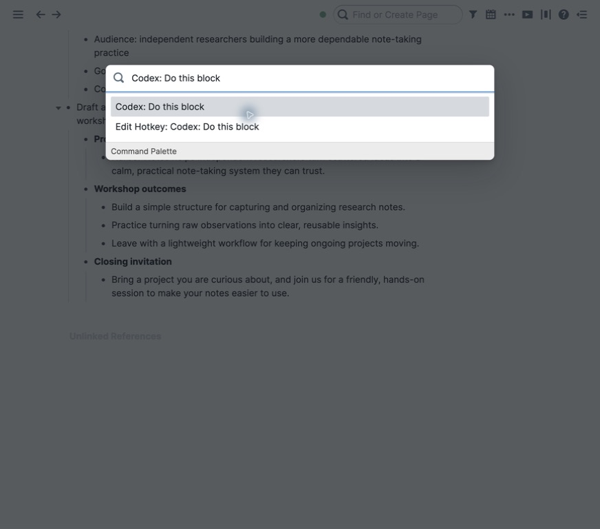
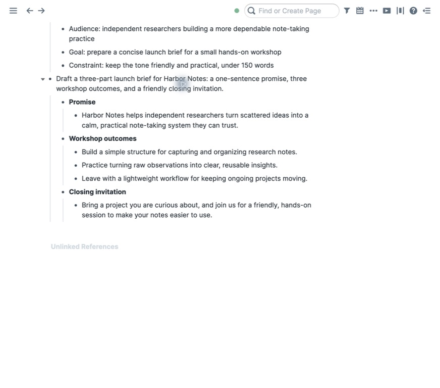

# Roam Codex

Use Codex from ordinary Roam blocks without giving up Roam's native editor.
Chat in the right sidebar, ask Codex to read or change the active graph, or run
a focused block as a direct graph task. Conversations stay attached to the
graph while Codex runs locally through its official App Server.



## What you can do

- Open persistent Codex chat beside any Roam block.
- Keep writing with Roam's normal Block Outline, page references, block
  references, autocomplete, and nested blocks.
- Read the graph, research current information, and request graph changes.
- Choose Auto, Read only, or Manual graph access per conversation.
- Steer an active turn with another block instead of stopping and restarting.
- Stop a turn without losing the submitted outline.
- Reopen graph-scoped conversation history.
- Run `Codex: Do this block` to carry out a task beneath a focused block through
  Roam MCP, with sources and caveats placed in native comments.

Codex replies remain in the chat panel unless the task explicitly writes to the
graph. The selected source block is never rewritten or deleted by `Do this
block`.

## Requirements

- Roam Research Desktop
- Node.js 20 or later
- A signed-in [Codex CLI](https://github.com/openai/codex), version `0.146.0`
  or later

The current integration is tested with Codex CLI `0.146.0` and
`@roam-research/roam-mcp` `0.9.1`.

## Install

### 1. Install Roam Codex

In Roam, open **Settings → Roam Depot**, find **Roam Codex**, and install it.

### 2. Install the bridge

The bridge is a small local program that connects Roam to the Codex App Server.
Run this once in a terminal:

```bash
npx roam-codex-bridge
```

It checks that the Codex CLI is installed, then installs itself as a background
service that starts at login and restarts itself if it ever stops. The service
runs from a private versioned copy under `~/.roam-better-ai/app/`, rather than
depending on npm's temporary `npx` cache. You do not need to keep the terminal
open, and you never need to run it again until you choose to update.

On macOS this installs the background service. On Windows and Linux, `setup`
validates the Codex CLI and then asks you to keep the bridge running in a
terminal instead:

```bash
npx roam-codex-bridge run
```

If the Codex CLI is missing, the command tells you how to install it:

```bash
npm install -g @openai/codex && codex login
```

### 3. Pair Roam with the bridge

Open the Codex panel in Roam — click the sparkle button beside the right-sidebar
toggle, or run `Codex: Open chat`. The panel shows a card asking you to pair.
Select **Pair**, then choose **Allow** in the dialog that appears on this
computer. That is the whole pairing step: the bridge learns which graph it
serves from the pairing itself, so there is no graph name to type anywhere.

If your graph has never been connected to Roam's local tools, Roam Desktop shows
its own approval dialog right afterwards. Approve that too.

On platforms without the native dialog, the panel asks for a one-time code
instead. Print it with:

```bash
npx roam-codex-bridge code
```

### Managing the bridge later

```bash
npx roam-codex-bridge status      # pairing, service, and health state
npx roam-codex-bridge stop        # stop the background service
npx roam-codex-bridge uninstall   # remove the background service
npx roam-codex-bridge run         # run in this terminal instead
```

If Codex is not signed in, or the bridge is stopped, the panel says so and
offers the fix in place — including a **Sign in** button for the Codex account.

## Use chat

Run `Codex: Open chat` from the command palette, use the sparkle button beside
Roam's right-sidebar toggle, or press `Cmd-J` on macOS (`Ctrl-J` elsewhere).

Write in the native composer and select **Send**. Its picker contains the model,
reasoning effort, graph access, and optional tools. During a turn, another
composer message can **Steer** it, while **Stop** interrupts it.



The conversation title opens history. History shows compact activity ages such
as `5m ago` and `3d ago`. Hover or keyboard-focus a conversation to reveal its
`⋯` menu; **Delete chat** permanently removes both the Codex thread and
its dedicated `Codex/thread/*` page. **New chat** starts with the model and
access defaults configured under **Settings → Extensions → Roam Codex**.

## Run a focused block

Focus an ordinary block and choose `Codex: Do this block`.



Codex preserves the source and appends the result beneath it through Roam MCP.
These one-shot runs use the fast service tier by default.



A temporary `[[Codex/running]]` child appears while the task runs and is removed
after success, failure, or Stop. Research sources, questions, and caveats are
placed in native comments instead of cluttering the result outline.

## Access and settings

The chat picker controls graph access per conversation:

- **Auto** — allow graph changes that the user explicitly requests.
- **Read only** — expose only graph-reading tools.
- **Manual** — pause approval-requiring graph changes for Allow or Reject.

The Tools section can opt other configured Codex MCP servers into chat. They
are disabled by default. Read-only conversations never expose graph write
tools.

Before each new or resumed turn, the extension reads the live
`[[roam/agent guidelines]]` outline and the bridge injects those conventions as
App Server developer instructions. If that local Roam read fails, the runtime
falls back to the official `get_graph_guidelines` MCP tool.

Roam's extension settings store only non-secret defaults:

- Local bridge URL
- Default access mode
- Default model
- Enabled optional MCP servers

The active graph always comes from Roam and is not a setting.

## Security and data

- The bridge accepts connections only on `127.0.0.1`.
- Pairing requires the allowed Roam origin, exact graph, and local consent
  through the native dialog or short-lived fallback code.
- The bearer token stays in the private bridge config and graph-scoped browser
  `localStorage`; it is not written to graph content or graph-synced settings.
- Conversation membership is recorded by `Codex/thread/*` pages in Roam.
  Device-local chat state contains only UI preferences, read markers, the
  active pointer, and pending graph-index retries; it is not a second history
  database.
- Runtime files and Codex threads use a graph-specific directory under
  `~/.roam-better-ai/graphs/`.
- The background service executable is copied to a private versioned directory
  under `~/.roam-better-ai/app/`; uninstall removes that copy while preserving
  configuration and logs.
- Roam MCP uses the active graph connection in the user's
  `~/.roam-tools.json`.
- The runtime receives only the explicit Roam tool allowlist and optional MCP
  servers enabled for the graph.
- Progress summaries are shown, but raw model reasoning is never exposed.
- Current or external factual work requires live sources; graph-only writing
  and organization do not browse.

## Troubleshooting

**The bridge is unavailable**

Run `npx roam-codex-bridge status`. It reports whether the background service is
installed, whether the bridge answers on `http://127.0.0.1:47321`, and where the
logs are. The chat panel also detects this by itself and reconnects as soon as
the bridge is back.

**The bridge is paired to a different graph**

Select **Use this graph instead** on the card in the chat panel and approve the
pairing again. Pairing moves the bridge to the graph you paired from.

**Pairing fails or the code expired**

Select **Pair** again for a fresh dialog or code. A code that has been used
successfully cannot be replayed.

**Codex is unavailable**

Verify `codex --version` works. If the CLI is not signed in, the chat panel
offers a **Sign in** button that opens the browser flow.

**A development run failed**

Inspect the ignored local trace at `.dev/last-run.jsonl`. It contains runtime
diagnostics, not the bridge bearer token.

## Remove

Run `npx roam-codex-bridge uninstall`, then remove or disable Roam Codex in
Roam Depot. Roam removes extension commands and styles on unload. Device-local
tokens, runtime profiles, and Codex thread files remain on disk until you
explicitly remove them.

## Development and project status

- [Architecture, protocol, safety, and verification](./DEVELOPMENT.md)
- [Release-readiness tracker](https://github.com/MaskyS/roam-codex-ai/issues/9)
- [Open issues](https://github.com/MaskyS/roam-codex-ai/issues)
- [Builder instructions](./AGENTS.md)
